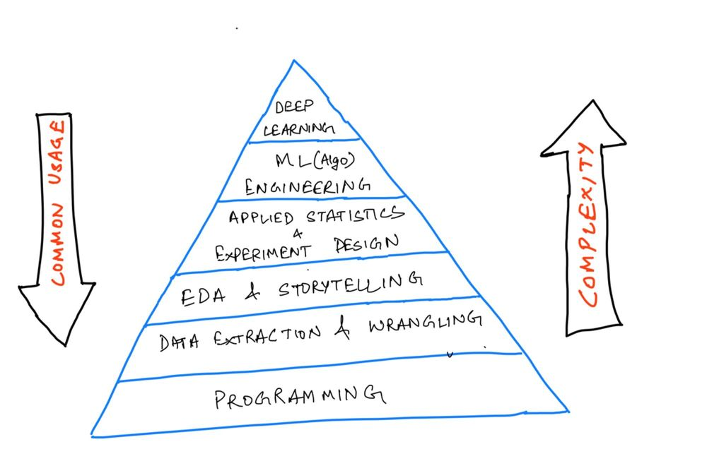

This is notes from three months intensive Data Scientist BootCamp. For later using and for continuously learning as well as improving. The Road never ends like learning itself. :nerd_face:

The BootCamp started with data analysis and machine learning with Python on a different project each week. Using the pandas library to rapidly wrangle and visualize datasets, as well as learned to train models with scikit-learn and also deep dive into the maths behind the models, and learn to optimize model performance and discuss business cases. Eventually we reached Deep Learning.

Thanks to [Spiced Academy](https://www.spiced-academy.com/en/program/data-science) who has provides great opportunity.
